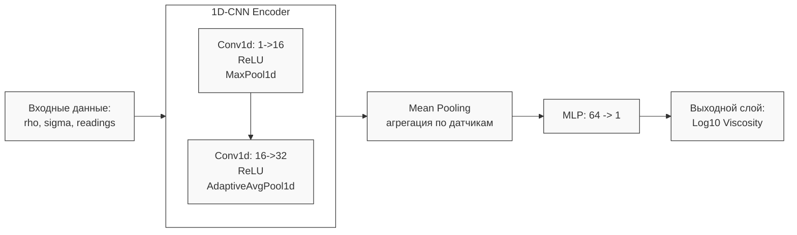

# Анализ реализации Модели Варианта 2: CNN-MLP с конкатенацией признаков

Данный документ описывает результаты применения глубокого обучения (1D-CNN) для определения динамической вязкости $\mu$.

## 1. Архитектура модели

Ниже представлена визуализация архитектуры:

- **1D-CNN Encoder**: Извлекает локальные признаки формы волны из временного ряда каждого датчика. Состоит из двух сверточных блоков с ReLU-активацией и пулингом.
- **Mean Pooling**: Вычисляет средний вектор признаков по всем активным датчикам ($V_{global}$).
- **MLP (Предиктор)**: Полносвязная сеть из слоев $[64 \to 1]$, принимающая конкатенированный вектор $[V_{global}, \rho, \sigma]$.

---

## 2. Результаты обучения и тестирования

| Метрика | Значение |
| :--- | :---: |
| **MAE (Средняя абс. ошибка)** | $0.1092$ |
| **$R^2$ Score (Коэф. детерминации)** | $0.8026$ |

### Сравнение результатов

| Модель | $R^2$ Score | MAE |
| :--- | :---: | :---: |
| **Вариант 1** | $0.8228$ | $0.1067$ |
| **Вариант 2** | **$0.8026$** | **$0.1092$** |

---

## 3. Выводы

Хотя Вариант 2 (CNN-MLP) показал высокую точность ($R^2 \approx 0.80$), он всё еще немного уступает бустингу (Вариант 1).

**Итог:** Модель доказала свою работоспособность, но подтвердила необходимость более продвинутых механизмов агрегации пространственных данных, таких как Attention (Вариант 3).

---
11.05.2026 MSK | gemma-4-31b-it
Обновление результатов и детализация архитектуры.