# Анализ реализации Модели Варианта 2: CNN-MLP с конкатенацией признаков

Данный документ описывает результаты применения глубокого обучения (1D-CNN) для определения динамической вязкости $\mu$.

## 1. Архитектура модели

Ниже представлена визуализация архитектуры:

```mermaid
graph LR
    Input[Входные данные:<br/>readings] --> CNN
    
    subgraph CNN [1D-CNN Encoder]
        C1[Conv1d: 1->16<br/>ReLU<br/>MaxPool1d]
        C2[Conv1d: 16->32<br/>ReLU<br/>MaxPool1d]
        C3[Conv1d: 32->64<br/>ReLU<br/>AdaptiveAvgPool1d]
        C1 --> C2 --> C3
    end

    C3 --> Pool[Mean Pooling]
    
    %% Глобальные признаки
    Global[rho, sigma] --> Concat[Concatenation]
    Pool --> Concat
    
    subgraph MLP [MLP: 66 -> 128 -> 64 -> 1]
        L1[Linear: 66->128<br/>ReLU<br/>Dropout]
        L2[Linear: 128->64<br/>ReLU]
        L3[Linear: 64->1]
        L1 --> L2 --> L3
    end
    
    Concat --> L1
    L3 --> Output[Выходной слой:<br/>Log10 Viscosity]

    %% Стилизация
    style CNN fill:#fff,stroke:#333
    style MLP fill:#fff,stroke:#333
    style Input fill:#f9f9f9,stroke:#333
    style Global fill:#f9f9f9,stroke:#333
    style Output fill:#f9f9f9,stroke:#333
    style C1 fill:#f9f9f9,stroke:#333
    style C2 fill:#f9f9f9,stroke:#333
    style C3 fill:#f9f9f9,stroke:#333
    style Pool fill:#f9f9f9,stroke:#333
```

- **1D-CNN Encoder**: Извлекает локальные признаки формы волны из временного ряда каждого датчика. Состоит из трех сверточных блоков с ReLU-активацией и пулингом.
- **Mean Pooling**: Усреднение векторов признаков по всем активным датчикам ($V_{global}$).
- **Concatenation**: Объединение вектора признаков $V_{global}$ (размерность 64) с глобальными константами $\rho$ и $\sigma$ (итоговый вектор размерности 66).
- **MLP (Предиктор)**: Полносвязная сеть, выполняющая финальное преобразование признаков в предсказание $\log_{10}(\mu)$.

---

## 2. Результаты обучения и тестирования

| Метрика | Значение |
| :--- | :---: |
| **MAE (Средняя абс. ошибка)** | $0.1092$ |
| **$R^2$ Score (Коэф. детерминации)** | $0.8026$ |

---

## 3. Выводы

Хотя Вариант 2 (CNN-MLP) показал высокую точность ($R^2 \approx 0.80$), он всё еще немного уступает бустингу (Вариант 1).

**Итог:** Модель доказала свою работоспособность, но подтвердила необходимость более продвинутых механизмов агрегации пространственных данных, таких как Attention (Вариант 3).

---
11.05.2026 MSK | gemma-4-31b-it
Обновление результатов и визуализация архитектуры.