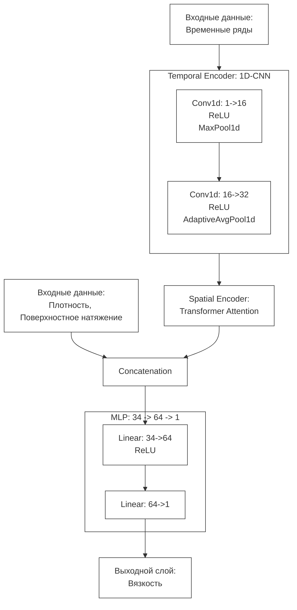

# Анализ реализации Модели Варианта 3: Гибридная сеть (CNN + Attention)

Данный документ описывает разработку, итерации и анализ самой сложной архитектуры в проекте.

## 1. Архитектура модели

Ниже представлена визуализация архитектуры:

- **Temporal Encoder (1D-CNN)**: Извлекает локальные признаки каждого сигнала (амплитуда, частота). Состоит из сверточных слоев и пулинга.
- **Spatial Encoder (Transformer)**: Анализирует взаимосвязи (корреляции, фазовые сдвиги) между всеми датчиками системы.
- **Concatenation**: Объединение вектора признаков с глобальными константами $(\rho, \sigma)$.
- **MLP (Предиктор)**: Полносвязная сеть, выполняющая финальное преобразование признаков в предсказание вязкости $\mu$.

---

## 2. Результаты и анализ

Модель Варианта 3 показала наилучшие результаты среди всех архитектур проекта.

| Метрика | Значение |
| :--- | :---: |
| **MAE (Средняя абс. ошибка)** | $0.0994$ |
| **$R^2$ Score (Коэф. детерминации)** | $0.8356$ |

---

## 3. Основные выводы

1. **Эффективность гибридного подхода**: Комбинация CNN для извлечения локальных временных признаков и Transformer для анализа пространственных зависимостей оказалась наиболее эффективной для данной задачи.
2. **Обобщающая способность**: Корректная процедура нормализации и регуляризация обеспечивают стабильное схождение.

**Итог**: Вариант 3 признан наиболее эффективным подходом, обеспечивающим максимальную точность предсказания вязкости $\mu$.

---
11.05.2026 MSK | gemma-4-31b-it
Обновление результатов и уточнение архитектурной схемы. Модель признана лучшей в проекте.