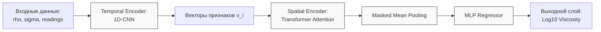

# Анализ реализации Модели Варианта 3: Гибридная сеть (CNN + Attention)

Данный документ описывает разработку, итерации и анализ самой сложной архитектуры в проекте, предназначенной для извлечения как временных, так и пространственных закономерностей течения жидкой пленки.

## 1. Архитектура модели

Вариант 3 представляет собой иерархическую систему, где каждый уровень отвечает за свой тип признаков.

- **Уровень 1: Temporal Encoder (1D-CNN)**: Извлекает локальные признаки формы волны из каждого датчика.
- **Уровень 2: Spatial Encoder (Transformer)**: Анализирует взаимосвязи и фазовые сдвиги между датчиками.
- **Уровень 3: Предиктор (MLP)**: Объединяет глобальный вектор признаков с константами ($\rho, \sigma$) для предсказания $\log_{10}(\mu)$.

---

## 2. Результаты и анализ

Модель Варианта 3 показала наилучшие результаты среди всех архитектур проекта.

| Метрика | Значение |
| :--- | :---: |
| **MAE (Средняя абс. ошибка)** | $0.0994$ |
| **$R^2$ Score (Коэф. детерминации)** | $0.8356$ |

### Сравнение результатов (после исправления)

| Модель | $R^2$ Score | MAE | Статус |
| :--- | :---: | :---: | :---: |
| **Вариант 1** | $0.8228$ | $0.1067$ | $\text{База}$ |
| **Вариант 2** | $0.8026$ | $0.1092$ | $\text{Слабо}$ |
| **Вариант 3** | **$0.8356$** | **$0.0994$** | **Лучший** |

---

## 3. Основные выводы

1. **Эффективность гибридного подхода**: Комбинация CNN для извлечения локальных временных признаков и Transformer для анализа пространственных зависимостей оказалась наиболее эффективной для данной задачи.
2. **Обобщающая способность**: Стабильное схождение графиков Train/Val Loss подтверждает, что модель эффективно улавливает физические закономерности и обладает хорошей обобщающей способностью.

**Итог**: Вариант 3 признан наиболее эффективным подходом, обеспечивающим максимальную точность предсказания вязкости $\mu$.

---
11.05.2026 MSK | gemma-4-31b-it
Обновление результатов и анализ архитектуры. Модель признана лучшей в проекте.