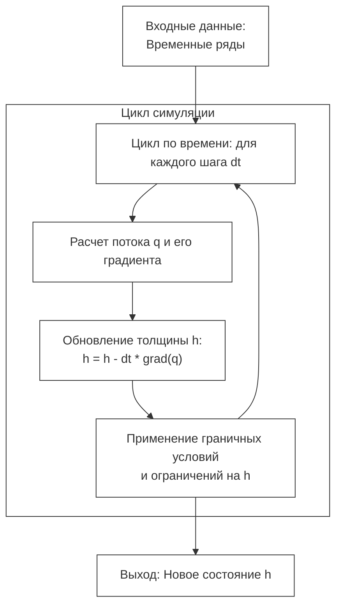

# Спецификация физической модели: Волны Капицы

## Теоретическая основа
Для моделирования динамики тонкой жидкой пленки используется **теория смазки (Lubrication Theory)**. Вместо решения полных трехмерных уравнений Навье-Стокса, мы переходим к одномерному уравнению эволюции толщины пленки $h(x, t)$.

Модель описывает течение жидкости, где характерный масштаб толщины пленки намного меньше её длины. В этом режиме доминируют силы вязкости и гравитации, а влияние инерции пренебрежимо мало.

## Математическая модель
Основным уравнением для определения толщины пленки $h$ в зависимости от координаты $x$ (вдоль стенки) и времени $t$ является уравнение неразрывности:

$$\frac{\partial h}{\partial t} + \frac{\partial q}{\partial x} = 0$$

где $q$ — объемный расход жидкости на единицу ширины. Для пленки, стекающей под действием силы тяжести с учетом капиллярных эффектов (поверхностного натяжения), расход имеет вид:

$$q = \frac{h^3}{3\mu} \left( \rho g - \sigma \frac{\partial^3 h}{\partial x^3} \right)$$

### Итоговое уравнение эволюции:
$$\frac{\partial h}{\partial t} + \frac{\partial}{\partial x} \left[ \frac{h^3}{3\mu} \left( \rho g - \sigma \frac{\partial^3 h}{\partial x^3} \right) \right] = 0$$

## Параметры модели

### Физические константы (входные параметры):
- $\rho$ — плотность жидкости ($\text{кг}/\text{м}^3$).
- $\mu$ — динамическая вязкость ($\text{Па}\cdot\text{с}$).
- $\sigma$ — коэффициент поверхностного натяжения ($\text{Н}/\text{м}$).
- $g$ — ускорение свободного падения ($\approx 9.81 \text{ м}/\text{с}^2$).

### Параметры сценария:
- $h_0$ — средняя начальная толщина пленки (м).
- $L$ — высота стенки (м).
- $T$ — общее время наблюдения (с).
- $\delta$ — амплитуда начального случайного возмущения (необходима для инициации роста волн).

## Связь с числом Рейнольдса
Число Рейнольдса $Re$ определяет режим течения и вероятность появления волн:
$$Re = \frac{\rho v h_0}{\mu}$$
Для обучения ML-модели важно генерировать данные в режиме $Re \le 50$.

## Целевые параметры предсказания (Target Parameters)
В данной работе модель машинного обучения настраивается на предсказание двух основных параметров системы в установившемся режиме:

1. **Динамическая вязкость ($\mu$)**: Определяет скорость затухания и частоту волн.
2. **Средняя толщина пленки ($h_{final}$)**: Среднее значение толщины пленки по всей высоте стенки в конце периода наблюдения.

## Программная реализация

### Алгоритм вычисления $h(x, t)$
Для решения уравнения эволюции используется метод конечных разностей. Процесс симуляции организован следующим образом:

1. **Инициализация**: Задается начальный профиль толщины $h(x, 0) = h_0 + \text{random}(-\delta, \delta)$.
2. **Внешний цикл**: Итерационный расчет состояния системы на временном интервале $[0, T]$.
3. **Обновление**: На каждом шаге $\Delta t$ вычисляется расход $q$, берется его пространственный градиент, и состояние $h$ корректируется.
4. **Граничные условия**: Постоянный приток сверху, свободное вытекание снизу.

### Генерация датасета
Процесс автоматизирован с помощью скрипта `src/data_gen/generator.py`:
1. **Сэмплирование**: Выбор комбинаций $(\rho, \mu, \sigma, h_0)$.
2. **Симуляция**: Запуск расчета $h(x, t)$ для каждой комбинации.
3. **Сбор данных**: Запись значений толщины с виртуальных датчиков.
4. **Сохранение**: Запись в структурированный формат (HDF5).

## Физические допущения
- **Ламинарность**: $Re \le 50$.
- **Постоянство свойств**: $\rho, \mu, \sigma$ не зависят от координат.
- **Прилипание**: Условие no-slip на стенке.
- **Игнорирование инерции**: Приближение тонкого слоя.

---
11.05.2026 MSK | gemma-4-31b-it
Обновлена схема алгоритма: добавлена корректная экранировка спецсимволов для визуализации.