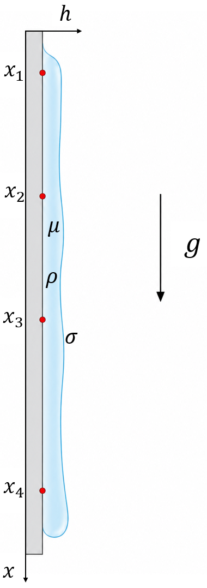

# 1 ПОСТАНОВКА ЗАДАЧИ

## 1.1 Анализ области исследования: динамика течения жидких пленок

Течение тонких слоев жидкости, называемых жидкими пленками, представляет собой фундаментальный процесс в гидродинамике и имеет широкое применение в современной промышленности. Пленочные аппараты (Film Apparatus, FA) используются в нефтехимическом синтезе, теплоэнергетике и пищевом производстве для организации эффективного тепломассообмена. Основным преимуществом данных устройств является большая свободная поверхность раздела фаз при малой тол thicknesses пленки. Это обеспечивает высокую скорость диффузионных и химических процессов на границе раздела газ-жидкость [3-5].

Динамика течения пленок характеризуется возникновением волновых структур, которые существенно влияют на интенсивность теплообмена и гидродинамическое сопротивление. Исследование этих процессов позволяет оптимизировать конструкцию промышленных ректификаторов, абсорберов и конденсаторов. Понимание механизмов формирования волн необходимо для предотвращения разрыва пленки и обеспечения равномерного смачивания поверхностей. Современные исследования фокусируются на поиске методов точного мониторинга характеристик течения в режиме реального времени [7-10].

## 1.2 Описание физического процесса и постановка задачи идентификации параметров

Движение жидкой пленки по вертикальной стенке происходит под действием силы тяжести и ограничивается силами вязкого трения. Схематичное изображение физического процесса и расположения измерительных датчиков представлено на рисунке 1.1.

Рисунок 1.1 – Схема физического процесса и расположения датчиков

В определенных условиях течения поверхность пленки становится неустойчивой и на ней формируются так называемые волны Капицы [1-2]. Характеристики этих волн, включая их амплитуду, частоту и фазовую скорость, напрямую зависят от физических свойств жидкости и параметров течения. Ключевыми параметрами в данной системе являются динамическая вязкость (Dynamic Viscosity, $\mu$) и средняя толщина пленки (Average Film Thickness, $h_{final}$).

Для анализа динамики пленки используется система локальных датчиков, которые измеряют мгновенную толщину слоя $h(t)$ в различных точках вдоль стенки. Каждый датчик формирует временной ряд, отражающий прохождение волновых фронтов. Задача идентификации параметров заключается в восстановлении значений $\mu$ и $h_{final}$ на основе анализа полученных сигналов. Данная проблема относится к классу обратных задач, поскольку требуется определить внутренние свойства системы по косвенным внешним признакам. Сложность задачи обусловлена нелинейным характером волновых процессов и наличием высокочастотных шумов в данных датчиков.

## 1.3 Цели и задачи работы

Целью данной работы является разработка и исследование алгоритмов машинного обучения для точного определения динамической вязкости и средней толщины жидкой пленки по временным рядам ее толщины. Достижение этой цели требует реализации комплексного подхода, объединяющего физическое моделирование и методы анализа данных.

Для реализации намеченной цели решаются следующие задачи. Первая задача включает разработку физической модели эволюции толщины пленки с использованием уравнения тонкого слоя. Вторая задача состоит в создании автоматизированной системы генерации синтетического датасета, который охватывает широкий диапазон значений вязкости и толщины. Третья задача предполагает исследование и разработку нескольких архитектур машинного обучения, включая модели градиентного бустинга и нейронные сети с механизмами внимания. Четвертая задача заключается в проведении сравнительного анализа точности разработанных моделей и обосновании выбора оптимального алгоритма.

## 1.4 Ожидаемые результаты и практическая значимость

Результатом работы является программный комплекс, способный с высокой точностью определять параметры жидкости в пленочных аппаратах без прямого вмешательства в процесс. Ожидается, что разработанная модель обеспечит коэффициент детерминации $R^2$ на уровне, достаточном для промышленного применения. 

Практическая значимость работы заключается в создании инструмента для неинвазивного мониторинга свойств жидкостей в реальном времени. Внедрение такого решения в технологические линии позволит оперативно контролировать чистоту реагентов, температуру среды или состав смеси через анализ вязкости. Это снижает риск брака продукции и повышает общую эффективность работы химических и энергетических установок. Предложенный подход с использованием обогащенных признаков и градиентного бустинга может быть адаптирован для других задач идентификации параметров в гидродинамических системах.

## Выводы по главе 1

В первой главе проведен анализ области исследования и обосновано применение пленочных аппаратов в промышленности. Описан физический процесс формирования волн Капицы и сформулирована задача идентификации параметров $\mu$ и $h_{final}$ по временным рядам толщины. Определены цель и основные задачи работы, а также выявлена практическая значимость разработки алгоритмов машинного обучения для мониторинга свойств жидкостей. Таким образом, создана теоретическая основа для последующей разработки физической модели и реализации алгоритмов анализа данных.
