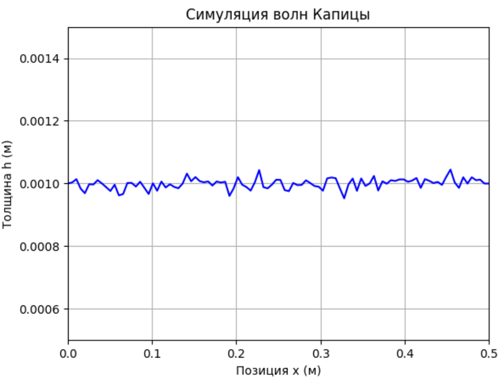
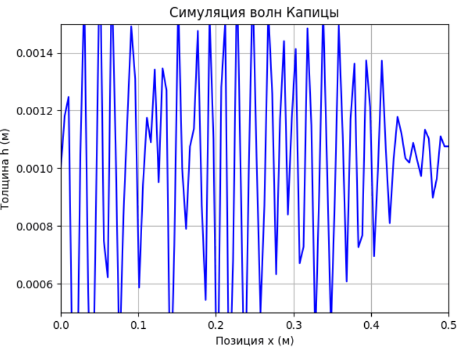
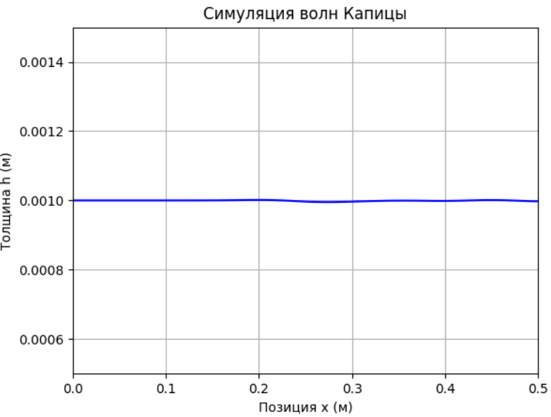
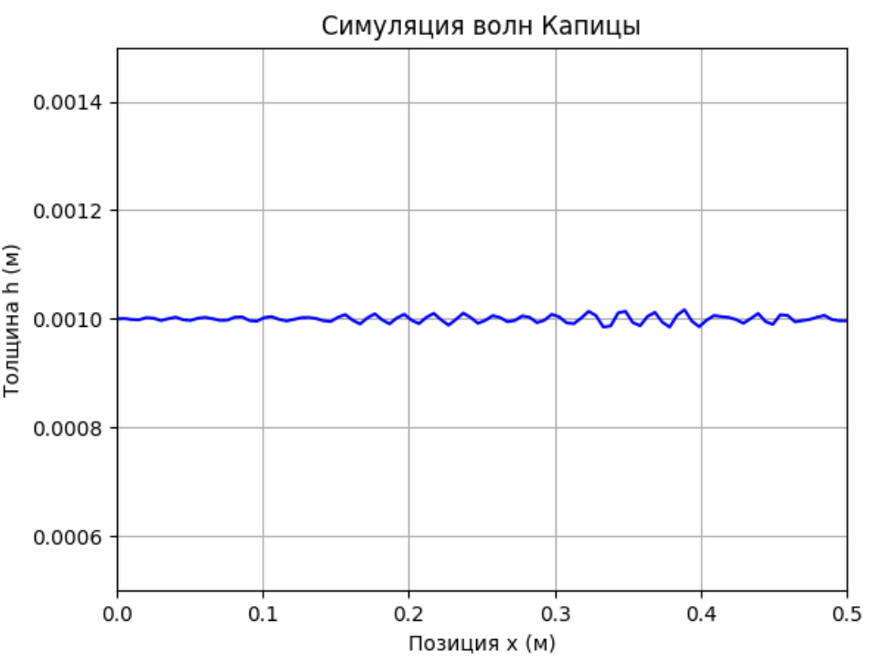

# 2 МАТЕМАТИЧЕСКОЕ МОДЕЛИРОВАНИЕ И ЧИСЛЕННАЯ РЕАЛИЗАЦИЯ

## 2.1 Теоретические основы моделирования тонких жидких пленок

Моделирование динамики жидких пленок базируется на принципах механики сплошных сред и теории смазки (Lubrication Theory) [11]. Основным допущением данной теории является значительное преобладание характерного масштаба длины пленки над ее толщиной. В таком режиме влияние инерционных сил становится пренебрежимо малым по сравнению с силами вязкости и гравитации. Данный подход упрощает полные трехмерные уравнения Навье-Стокса до одномерного уравнения эволюции толщины пленки.

Течение жидкости по вертикальной поверхности происходит под действием силы тяжести. Вязкое сопротивление жидкости ограничивает скорость потока и определяет профиль скоростей. При достижении определенного числа Рейнольдса (Reynolds Number, $Re$) гладкое течение становится неустойчивым. В результате этого процесса на поверхности жидкости формируются стационарные или перемещающиеся волны, которые в литературе получили название волн Капицы [1-2]. Характеристики данных волн несут информацию о физических свойствах жидкости. Использование данных волн целесообразно для задач идентификации параметров системы.

## 2.2 Вывод уравнения эволюции толщины пленки (модель волн Капицы)

Математическая модель описывает изменение толщины пленки $h$ в зависимости от пространственной координаты $x$ вдоль стенки и времени $t$. В основе модели лежит закон сохранения массы, который выражается уравнением неразрывности:

$$\frac{\partial h}{\partial t} + \frac{\partial q}{\partial x} = 0$$

Здесь $q$ представляет собой объемный расход жидкости на единицу ширины. Общий расход складывается из двух основных компонентов: гравитационного потока и потока, обусловленного капиллярными эффектами. Гравитационный член определяет основное движение жидкости вниз по стенке. Капиллярный член, связанный с коэффициентом поверхностного натяжения $\sigma$, отвечает за сглаживание кривизны поверхности и формирование волновых структур.

Итоговое уравнение эволюции толщины пленки принимает следующий вид:

$$\frac{\partial h}{\partial t} + \frac{\partial}{\partial x} \left[ \frac{h^3}{3\mu} \left( \rho g - \sigma \frac{\partial^3 h}{\partial x^3} \right) \right] = 0$$

В данном уравнении $\rho$ обозначает плотность жидкости, $g$ — ускорение свободного падения, а $\mu$ — динамическую вязкость (Dynamic Viscosity). Коэффициент $\frac{h^3}{3\mu}$ характеризует вязкостное сопротивление течению. Снижение значения вязкости или увеличение толщины слоя приводит к росту скорости потока.

## 2.3 Разработка численного метода решения на основе конечных разностей (FDM)

Для реализации математической модели выбран метод конечных разностей (Finite Difference Method, FDM) [11, 12]. Этот подход предполагает дискретизацию пространственной области $L$ на $N_x$ узлов с фиксированным шагом $\Delta x$. Временной интервал $T$ разбивается на дискретные шаги $\Delta t$. Состояние системы в каждый момент времени описывается вектором значений толщины пленки в узлах сетки. Начальный профиль толщины с заданным случайным возмущением представлен на рисунке 2.1.

Рисунок 2.1 – Начальное состояние пленки

Процесс вычисления проходит итерационно. На каждом временном шаге определяется текущий расход $q$ в каждой точке пространства. Расчет третьей производной $\frac{\partial^3 h}{\partial x^3}$ осуществляется с применением центральных разностей по соседним узлам. После определения расхода вычисляется его пространственная производная $\frac{\partial q}{\partial x}$, которая определяет скорость изменения толщины в данной точке. Обновление значения толщины происходит по схеме:

$$h(x, t + \Delta t) = h(x, t) - \Delta t \cdot \frac{\partial q}{\partial x}$$

Для корректного функционирования модели задаются граничные условия. На верхней границе (вход) поддерживается постоянный приток жидкости с заданной средней толщиной $h_0$. На нижней границе (выход) используется условие свободного вытекания, что выражается нулевым градиентом толщины $\frac{\partial h}{\partial x} = 0$.

## 2.4 Проблема численной устойчивости и внедрение гибридной схемы аппроксимации

Первичная программная реализация с использованием исключительно центральных разностей привела к возникновению численной неустойчивости. Данная проблема проявлялась в неконтролируемом экспоненциальном росте амплитуды волн, что приводило к расходимости решения. Анализ показал, что при высоких числах Рейнольдса центральные разности создают сильную дисперсию, которая дестабилизирует расчет. Результат вычислений по данной схеме показан на рисунке 2.2.

Рисунок 2.2 – Состояние пленки при использовании центральных разностей

В качестве альтернативы была рассмотрена схема «против потока» (Upwind scheme). Этот метод полностью устраняет проблему неустойчивости, однако вызывает эффект чрезмерной численной диффузии. Искусственная вязкость схемы сглаживает профиль толщины и подавляет формирование волн Капицы. Подобный эффект приводит к физической недостоверности результатов моделирования и их непригодности для обучения ML-модели. Состояние пленки при использовании схемы Upwind представлено на рисунке 2.3.

Рисунок 2.3 – Состояние пленки при использовании схемы Upwind

Для обеспечения физической достоверности результатов и исключения турбулентных эффектов, в данной работе установлено ограничение по числу Рейнольдса $Re \le 50$. Данный порог гарантирует сохранение ламинарного режима течения и высокую сходимость численных методов.

Для достижения баланса между стабильностью и точностью в диапазоне $Re \le 50$ внедрена гибридная схема аппроксимации производной расхода. Гравитационный поток вычисляется как линейная комбинация схем Upwind и Central. Такое смешивание позволяет подавить паразитные осцилляции без значительной потери динамики течения. При этом расчет капиллярного члена оставлен на базе центральных разностей, поскольку высокая точность аппроксимации кривизны поверхности критична для корректного моделирования волновых структур. Итоговое состояние пленки при использовании гибридной схемы показано на рисунке 2.4.

Рисунок 2.4 – Состояние пленки при использовании гибридной схемы

## 2.5 Верификация физической модели и анализ динамики волн

Верификация используемой модели базируется на сравнении полученных результатов с фундаментальными экспериментальными данными. Первичное подтверждение корректности модели было получено в работах П.Л. Капицы [1-2], где теоретические предсказания амплитуды и частоты волн совпали с результатами натурных измерений. В современных исследованиях для высокоточной валидации динамики пленок применяется метод лазерно-индуцированной флуоресценции (Laser-Induced Fluorescence, LIF) [18]. Данный метод позволяет с микронной точностью фиксировать профиль толщины пленки в реальном времени, что подтверждает высокую достоверность уравнения эволюции толщины при соблюдении условий ламинарности течения.

В рамках данной работы верификация модели проводилась путем анализа профилей толщины пленки в динамике. При задании начального случайного возмущения амплитудой $\delta$ в системе наблюдается рост неустойчивости и формирование регулярных волновых структур. Модель демонстрирует корректное перемещение волновых фронтов вниз по стенке, что соответствует физике процесса.

Анализ результатов показал, что частота и скорость перемещения волн существенно зависят от динамической вязкости $\mu$. При увеличении вязкости амплитуда волн снижается, а их развитие замедляется. Эти закономерности подтверждают работоспособность модели и ее пригодность для генерации синтетических данных. Итоговая программная реализация оптимизирована с использованием векторизации библиотек NumPy, что обеспечивает высокую скорость вычислений при создании масштабных датасетов.

## Выводы по главе 2

Во второй главе осуществлен переход от теоретического описания процесса к математической модели. Сформулировано уравнение эволюции толщины пленки на основе теории смазки, учитывающее гравитационные и капиллярные эффекты. Разработан алгоритм численного решения методом конечных разностей. Внедрение гибридной схемы аппроксимации позволило решить проблему численной неустойчивости, сохранив при этом физическую достоверность волновых процессов. Результаты верификации подтвердили корректную работу модели, что создает базу для последующей автоматизированной генерации синтетических данных.
