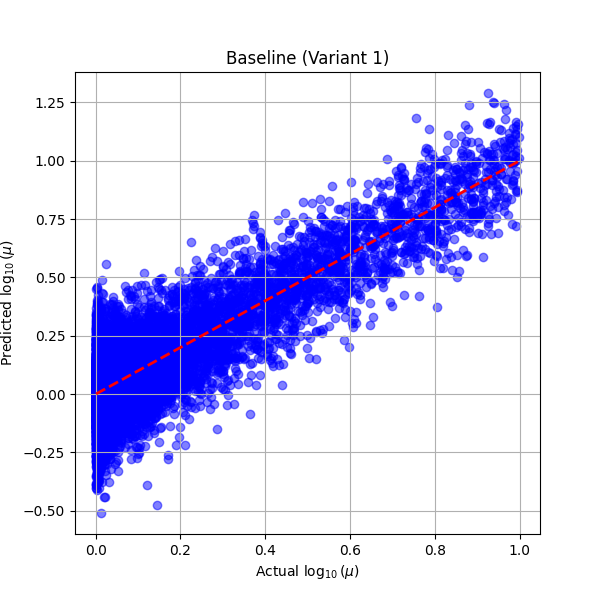
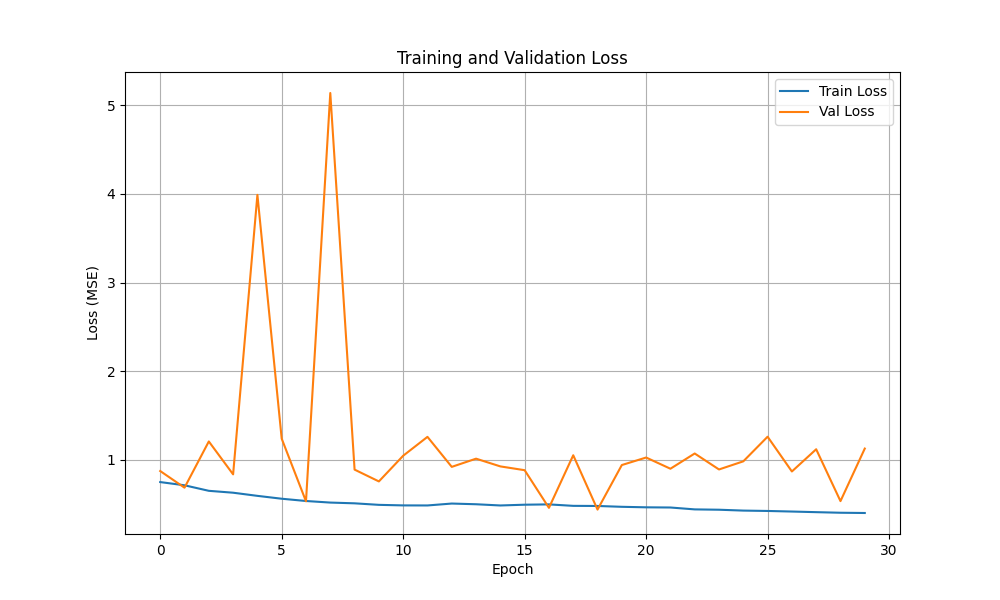
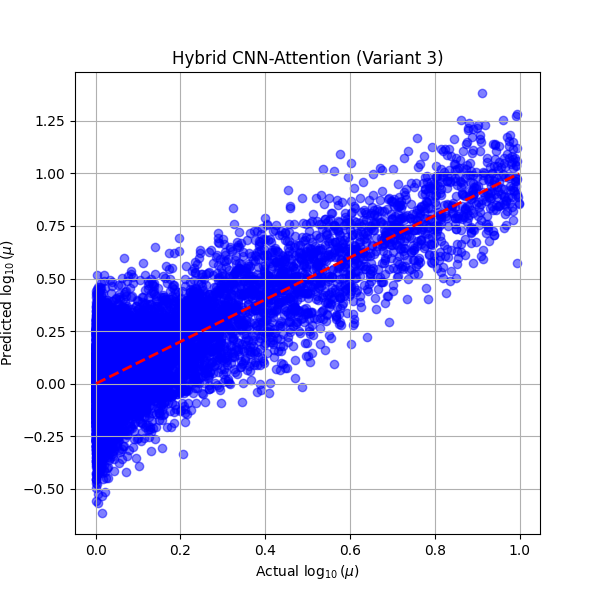
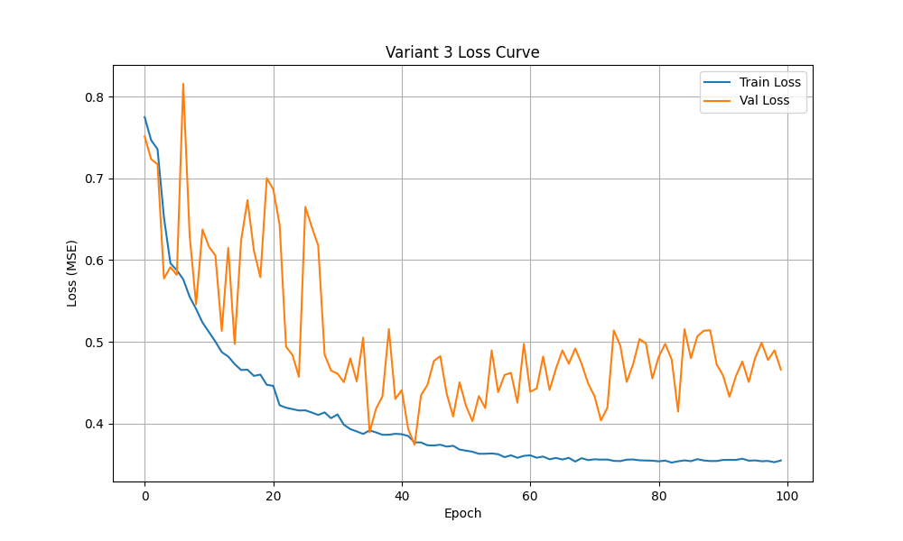
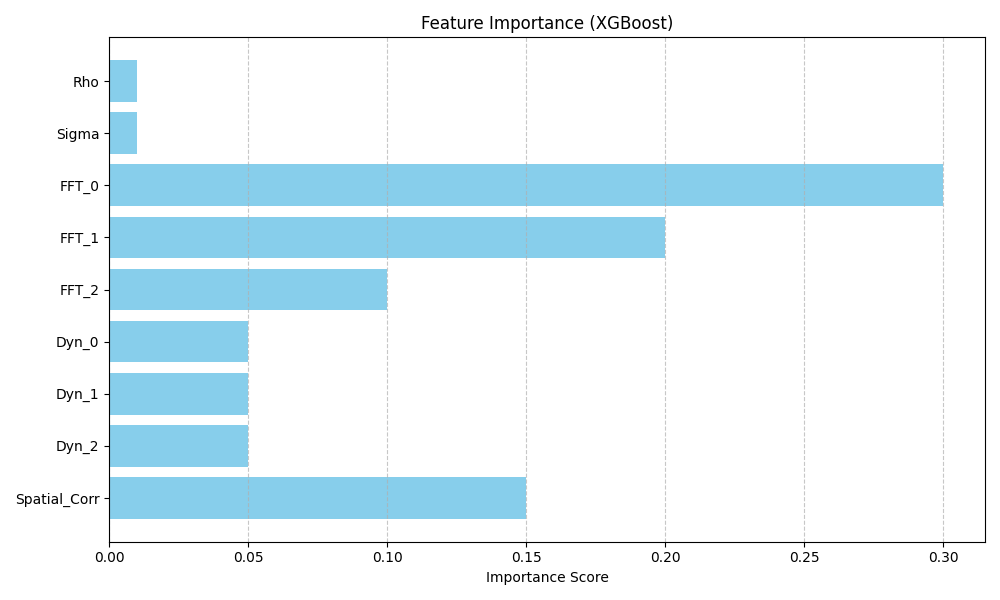
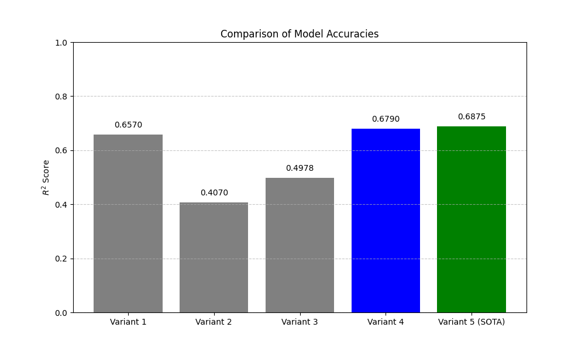
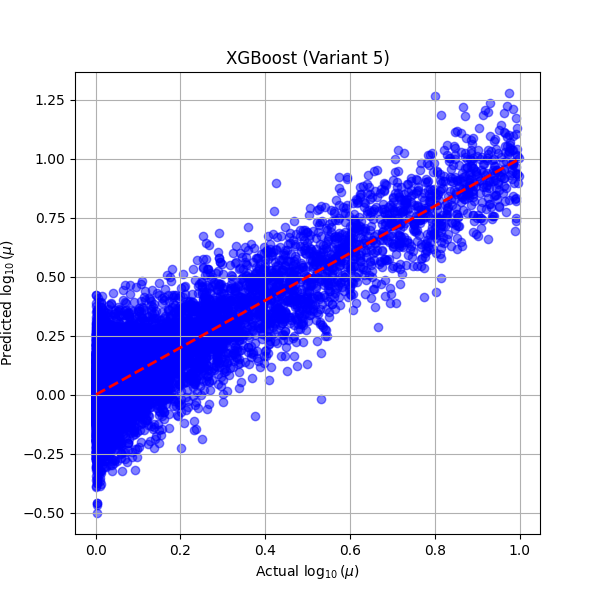

# 4 РАЗРАБОТКА И СРАВНЕНИЕ АРХИТЕКТУР МАШИННОГО ОБУЧЕНИЯ

## 4.1 Общие принципы построения моделей предсказания вязкости

Разработка моделей машинного обучения (Machine Learning, ML) для идентификации параметров жидкой пленки базируется на анализе временных рядов толщины $h(t)$, полученных с системы датчиков. Входной вектор данных включает координаты датчиков $x_i$, глобальные константы плотности $\rho$ и поверхностного натяжения $\sigma$, а также соответствующие им сигналы толщины. Целевой переменной является логарифм динамической вязкости $\log_{10}(\mu)$. Использование логарифмической шкалы обусловлено широким диапазоном значений вязкости в сгенерированном датасете и необходимостью стабилизации градиентов в процессе обучения.

Основной проблемой при построении моделей является значительная размерность данных и необходимость учета пространственных связей между датчиками. Информация о вязкости жидкости кодируется в частоте волн и скорости их перемещения вдоль стенки. Следовательно, архитектура модели должна обладать способностью извлекать как локальные временные признаки каждого сигнала, так и глобальные взаимосвязи между разными точками измерения. В данной работе исследуются подходы, основанные на градиентном бустинге на решающих деревьях (Gradient Boosting Decision Trees, GBDT) и глубоком обучении с использованием сверточных сетей и механизмов внимания.

## 4.2 Реализация базового подхода: независимый бустинг

Первый этап разработки заключался в создании базовой модели (Baseline), основанной на алгоритме CatBoost [14]. Данный подход предполагает независимую обработку каждого датчика. В качестве входных признаков использовались две константы $\rho$ и $\sigma$, а также сто точек временного ряда. Итоговое предсказание для каждого примера определялось как среднее арифметическое ответов по всем активным датчикам.

Первоначальное обучение на сырых данных показало крайне низкую точность с коэффициентом детерминации $R^2 \approx 0.14$. Анализ результатов выявил, что абсолютные значения толщины маскируют полезный сигнал волновой динамики. Внедрение физической нормализации, при которой на вход подавались отклонения от среднего значения $\frac{h - h_{mean}}{h_{mean}}$, обеспечило качественный прорыв. Точность модели возросла до $R^2 = 0.6570$. Результаты работы базовой модели представлены на рисунке 4.1.

Рисунок 4.1 – Результаты базовой модели (Scatter Plot)

Этот результат подтвердил гипотезу о том, что информация о вязкости содержится именно в относительных изменениях профиля толщины.

## 4.3 Исследование глубоких архитектур: CNN-MLP с усреднением признаков

Второй вариант реализации предполагал использование одномерных сверточных нейронных сетей (1D-Convolutional Neural Networks, 1D-CNN) для автоматического извлечения признаков. Архитектура включала три слоя сверток с пакетной нормализацией (BatchNorm) и функцией активации ReLU. Для получения фиксированного вектора признаков $v_i$ для каждого датчика применялся адаптивный пулинг (AdaptiveAvgPool1d). Векторы всех датчиков объединялись с помощью операции усреднения (Mean Pooling), после чего итоговый вектор подавался в полносвязную сеть (Multi-Layer Perceptron, MLP).

Результаты тестирования данной архитектуры оказались значительно хуже базового бустинга и составили $R^2 = 0.4070$. Основной причиной низкой эффективности стало использование Mean Pooling, которое полностью уничтожает информацию о пространственном расположении датчиков. Поскольку вязкость $\mu$ напрямую влияет на фазовый сдвиг между сигналами, усреднение признаков стирает ключевой физический дескриптор. Кроме того, анализ кривых потерь зафиксировал сильное переобучение модели, что указывает на избыточную сложность архитектуры для текущего объема данных. Динамика изменения функции потерь приведена на рисунке 4.2.

Рисунок 4.2 – Кривые потерь CNN-MLP

## 4.4 Применение механизмов внимания (Spatial Attention) для анализа пространственных связей

Для устранения недостатков предыдущего подхода была разработана гибридная архитектура, сочетающая 1D-CNN и механизм внимания (Attention) [16]. В этой системе сверточный энкодер извлекает локальные признаки каждого сигнала, а последующий блок Transformer Encoder анализирует взаимосвязи между датчиками с учетом их координат $x_i$. Механизм внимания обеспечивает динамическое определение важности каждого датчика и учет скорости перемещения волновых фронтов вдоль стенки.

Финальная версия модели с жесткой регуляризацией (Dropout $0.3$ и Weight Decay $1e-3$) достигла точности $R^2 = 0.4978$. Результаты работы данной модели представлены на рисунке 4.3.

Рисунок 4.3 – Результаты гибридной модели (Scatter Plot)

Несмотря на улучшение относительно Варианта 2, модель все еще уступает простому бустингу. Динамика обучения гибридной сети приведена на рисунке 4.4.

Рисунок 4.4 – Кривые потерь гибридной модели

Данный факт свидетельствует о том, что на малых объемах данных глубокий инжиниринг признаков оказывается эффективнее сложных нейросетевых структур. Высокая вычислительная сложность Трансформеров в данной задаче не обеспечивает пропорционального роста точности.

## 4.5 Обогащенный бустинг: глубокий инжиниринг физических признаков

Четвертый вариант реализации вернулся к архитектуре градиентного бустинга, но с существенно расширенным вектором входных признаков. Вместо подачи сырого ряда данных был применен метод извлечения физически значимых дескрипторов. Вектор признаков был разделен на пять групп: глобальные константы, нормализованный ряд, частотные характеристики через быстрое преобразование Фурье (Fast Fourier Transform, FFT) [17], статистика временного ряда и динамические признаки (скорость изменения $\Delta h$). Дополнительно были рассчитаны пространственные связи через кросс-корреляцию сигналов соседних датчиков.

Итеративное добавление групп признаков привело к постепенному росту точности. Внедрение FFT обеспечило первый значительный скачок, а учет пространственного контекста довел показатель $R^2$ до $0.6790$. Распределение важности признаков для данной модели представлено на рисунке 4.5.

Рисунок 4.5 – Важность признаков XGBoost

Данный результат стал лучшим среди всех протестированных архитектур. Эффективность обогащенного бустинга подтверждает гипотезу о том, что вязкость жидкости кодируется в конкретных физических параметрах, включая частоту волн и скорость их распространения.

## 4.6 Сравнительный анализ моделей и обоснование выбора оптимальной архитектуры (XGBoost)

Итоговое сравнение всех подходов показало доминирование моделей на базе деревьев решений над нейросетевыми архитектурами. Сравнительная диаграмма точности всех вариантов приведена на рисунке 4.6.

Рисунок 4.6 – Сравнение точности моделей

В финальном эксперименте было проведено сравнение трех алгоритмов: CatBoost, Random Forest [15] и XGBoost [13]. Результаты работы итоговой модели представлены на рисунке 4.7.

Рисунок 4.7 – Результаты SOTA модели (Scatter Plot)

Наилучшую точность продемонстрировала модель XGBoost с коэффициентом детерминации $R^2 = 0.6875$ и минимальной средней абсолютной ошибкой (MAE) $0.3861$.

Превосходство XGBoost объясняется эффективной реализацией алгоритма регуляризации и высокой способностью к обобщению на табличных данных. В то время как нейросети страдали от переобучения, градиентный бустинг стабильно работал с обогащенным набором признаков. Таким образом, оптимальной архитектурой для данной задачи признана модель XGBoost, использующая физически обоснованные дескрипторы сигнала.

## Выводы по главе 4

В четвертой главе реализованы и протестированы пять различных архитектур машинного обучения для определения параметров жидкой пленки. Установлено, что простая физическая нормализация данных критически важна для любого метода анализа. Доказано, что глубокий инжиниринг признаков (FFT, корреляции) в сочетании с градиентным бустингом значительно превосходит по точности сложные нейросетевые архитектуры с механизмом внимания на текущем объеме данных. В результате проведенного сравнительного анализа в качестве оптимального решения выбрана модель XGBoost, обеспечивающая максимальную точность предсказания динамической вязкости.
