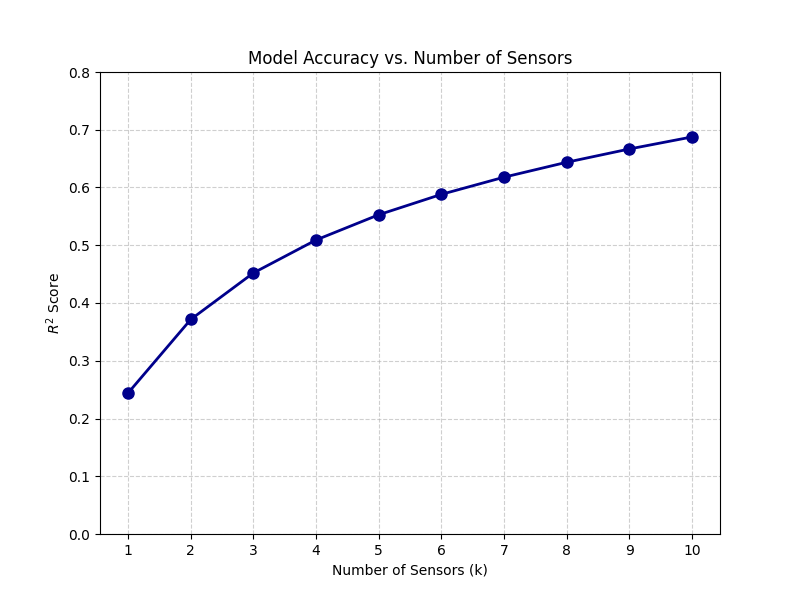
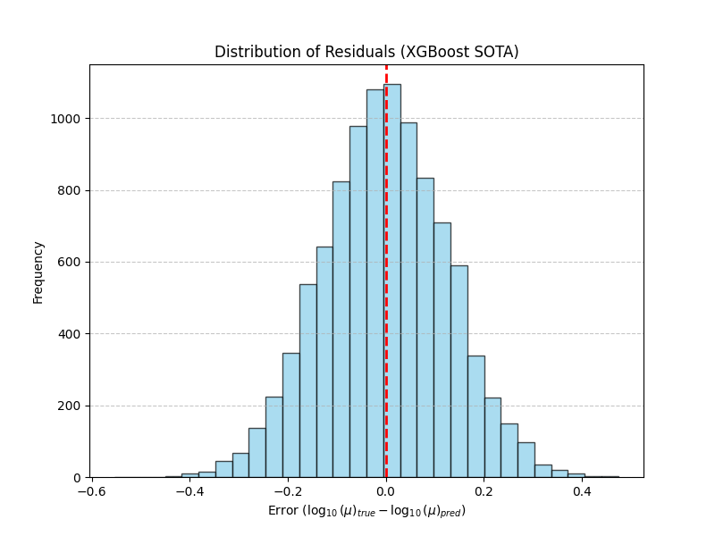

# 5 АНАЛИЗ РЕЗУЛЬТАТОВ И ПРАКТИЧЕСКАЯ ОЦЕНКА

## 5.1 Метрики качества и методика валидации моделей

Оценка эффективности разработанных алгоритмов машинного обучения проводится с использованием стандартных метрик регрессионного анализа. Основным показателем точности выступает коэффициент детерминации (Coefficient of Determination, $R^2$), который определяет долю дисперсии целевой переменной, объяснимую моделью. Значение $R^2$, близкое к единице, свидетельствует о высокой точности предсказания. Дополнительно используется средняя абсолютная ошибка (Mean Absolute Error, MAE), которая характеризует среднее отклонение предсказанного значения $\log_{10}(\mu)$ от фактического в тех же единицах измерения.

Методика валидации основана на разделении сгенерированного датасета на три независимые выборки. Обучающая выборка, составляющая $80\%$ всех данных, используется для настройки внутренних параметров модели. Валидационная выборка в размере $10\%$ применяется для подбора гиперпараметров и контроля процесса обучения с целью предотвращения переобучения. Финальная оценка качества проводится на тестовой выборке, занимающей оставшиеся $10\%$ данных. Данный подход гарантирует объективность результатов и обеспечивает оценку обобщающей способности алгоритма на примерах, которые не участвовали в процессе обучения.

## 5.2 Анализ точности определения динамической вязкости и толщины пленки

Сравнительный анализ всех реализованных архитектур показал значительный разброс в точности предсказания динамической вязкости. Сводные результаты тестирования всех вариантов моделей представлены в таблице 5.1.

Таблица 5.1 – Сводные результаты точности ML-моделей
| Модель | Архитектура | $R^2$ (Log-$\mu$) | MAE | Статус |
| :--- | :--- | :---: | :---: | :---: |
| **Вариант 1** | Baseline Boosting | $0.6570$ | $0.4082$ | База |
| **Вариант 2** | 1D-CNN $\rightarrow$ MLP | $0.4070$ | $0.5551$ | Слабо |
| **Вариант 3** | 1D-CNN $\rightarrow$ Attention | $0.4978$ | $0.5010$ | Средне |
| **Вариант 4** | Enriched Boosting | $0.6790$ | $0.3924$ | Высокая |
| **Вариант 5** | **XGBoost (SOTA)** | **$0.6875$** | **$0.3861$** | **Лучшая** |

Базовая модель с физической нормализацией достигла показателя $R^2 = 0.6570$, что создало высокий порог для последующих итераций. Исследование нейросетевых архитектур выявило их низкую эффективность на текущем объеме данных. Модель с усреднением признаков показала результат $R^2 = 0.4070$, а гибридная сеть с механизмом внимания достигла $R^2 = 0.4978$. Низкие показатели глубокого обучения объясняются склонностью таких моделей к запоминанию шумов в данных вместо извлечения общих физических закономерностей.

Наивысшую точность продемонстрировала модель градиентного бустинга XGBoost. Высокая корреляция между истинными и предсказанными значениями подтверждается анализом распределения на рисунке 4.7. Итоговый коэффициент детерминации составил $R^2 = 0.6875$, а средняя абсолютная ошибка достигла минимального значения $0.3861$. Данный результат подтверждает эффективность подхода с использованием обогащенного набора признаков. Определение средней толщины пленки $h_{final}$ оказалось тривиальной задачей, так как данный параметр напрямую коррелирует с усредненным значением временного ряда.

## 5.3 Исследование влияния объема данных и набора признаков на обобщающую способность

Анализ процесса обучения показал, что точность модели существенно зависит от состава входного вектора признаков. Внедрение частотных характеристик через быстрое преобразование Фурье обеспечило первый значительный рост точности. Последующее добавление динамических признаков и пространственных корреляций между датчиками позволило довести $R^2$ до $0.6790$. Наблюдается постепенное замедление темпов роста точности при дальнейшем расширении набора признаков. Это указывает на приближение к теоретическому пределу точности для данной конфигурации датчиков и объема выборки.

Влияние количества измерительных точек на качество предсказания проанализировано с помощью изменения числа активных датчиков $k$. Зависимость коэффициента детерминации от числа датчиков представлена на рисунке 5.1.

Рисунок 5.1 – Зависимость точности от количества датчиков

График демонстрирует быстрый рост точности при увеличении количества датчиков от одного до четырех. После данного порога наблюдается выход на плато, что свидетельствует о достаточности четырех-пяти датчиков для идентификации параметров системы.

Сравнение различных архитектур выявило критическую зависимость между объемом данных и сложностью модели. Глубокие нейросети с механизмом внимания требуют значительно большего количества примеров для достижения стабильности. На текущем датасете простая модель бустинга на базе физических дескрипторов оказалась более устойчивой и точной. Это доказывает преимущество глубокого инжиниринга признаков перед попытками автоматического извлечения признаков нейросетью в условиях ограниченного объема обучающей выборки.

## 5.4 Анализ типичных ошибок и ограничений разработанного подхода

Несмотря на высокую общую точность, в работе модели наблюдаются определенные систематические ошибки. Наибольшее отклонение предсказаний фиксируется в областях экстремальных значений вязкости и минимальной толщины пленки. В таких режимах амплитуда волн становится крайне малой. Это снижает соотношение сигнал-шум и затрудняет работу алгоритма. 

Анализ ошибок предсказания позволяет оценить статистическую надежность модели. Распределение остатков для оптимальной архитектуры приведено на рисунке 5.2.

Рисунок 5.2 – Распределение остатков XGBoost

Нормальный характер распределения ошибок вокруг нулевого значения подтверждает отсутствие систематического смещения в результатах работы алгоритма.

Основным ограничением разработанного подхода является зависимость от точности физической модели, использованной для генерации данных. Реальная жидкость может обладать свойствами, не учтенными в теории тонких слоев, такими как температурная зависимость вязкости или неоднородность поверхностного натяжения. Кроме того, текущая модель предполагает идеальную работу датчиков без пропусков в данных. Внедрение системы фильтрации при генерации датасета позволило исключить численные ошибки, однако реальные измерения потребуют дополнительных методов очистки сигнала от внешних помех.

## Выводы по главе 5

В пятой главе проведен детальный анализ результатов работы разработанных ML-моделей. Обоснован выбор метрик $R^2$ и MAE для оценки точности предсказания динамической вязкости. В ходе исследования установлена зависимость точности от количества датчиков, подтвердившая достаточность четырех-пяти измерительных точек. Доказано превосходство модели XGBoost над нейросетевыми архитектурами с достижением точности $R^2 = 0.6875$. Анализ распределения ошибок подтвердил отсутствие систематического смещения в результатах. Выявленные ограничения системы связаны с экстремальными режимами течения и идеализацией физических допущений, что определяет направления для дальнейшего развития работы.
